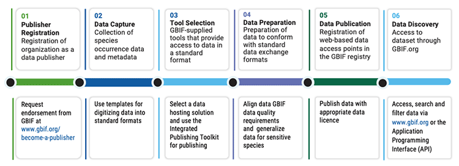

[[key-principles]]
== Key principles and concepts of data publishing 

=== Types of biodiversity data 

Biodiversity data can encompass structured information data across any level of biodiversity—molecular, species or ecosystem. These data can be either primary biodiversity data, such as observations or collections at a specific time and place, or secondary, synthesized or interpreted data, which combine biodiversity and environmental data from different sources to present real-world interpretations, as in a species distribution map. Although EIAs tend to present a considerable amount of secondary data, this information relies in turn on large volumes of the primary biodiversity data that are the focus of this document. 

The GBIF network specializes in bringing together ‘species occurrence data’ that typically includes, at a minimum, a scientific name, date and location of occurrence. Traditionally, these records have come from sources such as specimens from natural history collections, field work and monitoring surveys, but today other key sources include camera-trap images, environmental DNA (eDNA) sampling and citizen science projects.

While scientific name, date and location represent a minimum recommended level of information about an organism, occurrence records can include other useful information, such as the observation method, abundance counts, habitat structure (like height, stratification, density), abiotic characteristics (such as substrates, hydrology, climate) and associated information about land use and threats. https://www.gbif.org/data-quality-requirements[Learn more about data-quality requirements^].

GBIF publishes https://www.gbif.org/dataset-classes[four different classes of datasets^]: metadata-only, checklist, occurrence and sampling-event. These classes represent increasingly richer levels of information rather than different types of data. <<table-01,Table 1>> describes each class and examples of the type of information they include.  

[[table-01]]
.Steps to publishing data on GBIF.org
[cols=3*,options="header"]
|===
|Dataset Class
|Description
|Example

|Metadata dataset
|Information about the dataset
|Description of the methodologies used for collecting the data, date range, geographic and taxonomic scope (see https://www.gbif.org/dataset/a5b4d692-96bf-4acf-8809-b546e9938a5d[example^])

|Checklist Dataset
|Catalogue or list of named organisms, or taxa
|List of species recorded at a site, within a geographic area or sharing particular characteristics, e.g. medicinal plants, invasive alien species (see https://www.gbif.org/dataset/e7250318-b8ac-4780-b2c8-da946f4792da#description[example^])

|Occurrence dataset
|Occurrence of a species (or other taxon) at a particular place on a specified date
|Scientific name, latitude, longitude, date (see https://www.gbif.org/dataset/5dfd3144-25b0-4a1c-9df6-91b9cc231ccc[example^])

|Sampling-event dataset
|Occurrence data for a specific site that has been sampled using a specific protocol, including repeated samples over time, with abundances based on defined units and quantities, and sampling effort.
|Scientific name, latitude, longitude and how the species were collected/observed and in which series of monitoring events it was recorded (see https://www.gbif.org/dataset/8918109e-0d4a-4cc9-af7b-8e49d31df942[example^])
|=== 

=== Operating principles: Steps in the publishing process

GBIF provides a means of sharing biodiversity data through a publishing process that uses simple tools and follows standard procedures and protocols to make it universally accessible over the Internet. Data publishing through the GBIF network follows a series of clear steps, shown in <<figure-01,Figure 1>>. Each of these steps is described in more detail in the subsequent sections of this document.

This guide will help environmental assessment practitioners (EAPs), consultants and other interested and affected parties to choose the most suitable option or tool for publishing the primary biodiversity data they have gathered, as an integral part of the EIA process.

As a first step towards publishing biodiversity data, EAPs can seek assistance from the wide https://www.gbif.org/the-gbif-network[network of GBIF national, regional and thematic Participants^]. A majority of these nodes encourage, coordinate and assist in biodiversity data publishing activities within their respective jurisdictions and domains. If the EAP’s operations fall outside of the GBIF network e.g. in a country where there is no node, then the mailto:helpdesk@gbif.org[GBIF help desk] can provide additional support.

[[figure-01]]
.Data publishing workflow: steps for publishing data on GBIF.org

:sectnums!:

==== Step 1: Becoming a data publisher

Once an organization agrees to share EIA data, its staff must establish provisions ensuring that stakeholders in each stage of data collection, curation and management agree to the terms by which data publishing takes place and are properly acknowledged in their role. These provisions should include agreeing to the GBIF https://www.gbif.org/terms/data-publisher[Data Publisher Agreement^] (the English version is valid for legal purposes) and understanding the conditions of the GBIF https://www.gbif.org/terms/data-user[Data User Agreement^] that users of GBIF-mediated data must abide when reusing data.

==== Step 2. Data capture

Ensuring the standardization of data capture at point of collection will 

* make it easier for EAPs to collect and manage primary biodiversity data
* improve the consistency and utility of data collection
* ensure that the data are collected in a consistent format, suitable for publishing using the GBIF infrastructure. 

GBIF primarily relies on the Darwin Core (DwC) and Ecological Metadata Language (EML) standards, which set out the structure and format of published datasets (learn more about https://www.gbif.org/standards[applicable standards^]). 

GBIF provides https://www.gbif.org/dataset-classes[pre-configured Excel spreadsheets^] that can serve as templates for capturing checklist, occurrence and sampling-event data. These spreadsheets are simple tools aimed at providing a common format and standard for collecting data. They use consistent terminology and can be completed with additional DwC terms to fit the data collection purpose. This standardized approach makes it easier to exchange data between users, compare it across sites, and integrate it into national and global biodiversity databases. No metadata template is provided as publishers can use the built-in metadata editor in GBIF’s data publication tool–the Integrated Publishing Toolkit (IPT) (see <<step-03,Step 3>> below)–to populate the metadata. The IPT ensures that the data and metadata are in a valid XML format.

[[table-02]]
.Responses to key concerns raised by EIA data publishers
[cols=2*,options="header"]
|===
|Concern
|Response

|Providing precise data on occurrence of sensitive species (e.g. endangered, high-value) could lead to poaching or piracy
|Geographic coordinates can be generalized and other information withheld in published version of the data (see https://doi.org/10.15468/doc-5jp4-5g10[detailed guidance^])

|Commercial sensitivity of data during licensing period
|Data publication can be delayed until project receives approval

|Company faces possible reputational risk if, for example, biodiversity is damaged
|Over time, increased open data on species distributions will allow for more robust and transparent assessments of site-specific damage that can provide reputational dividends

|Sharing data may need government approval and buy-in
|https://www.cbd.int/doc/decisions/cop-13/cop-13-dec-31-en.pdf[Guidelines from the Convention on Biological Diversity] encourage open data sharing, and data mobilized through GBIF is an https://www.bipindicators.net/indicators/growth-in-species-occurrence-records-accessible-through-gbif[indicator of progress towards Aichi Biodiversity Target 19]

|Company could incur additional costs and require additional effort to monitor and share data
|Costs of monitoring should already be captured within the project budget; publication is free of charge, and open-access data can provide long-term savings

|Companies that don’t invest in sharing data can benefit from free and open data available through GBIF more than others who contribute to its supply and maintenance
|“Free riders” exist in any commons, but a large common pool resource like GBIF is not depleted by use, and parties that do participate typically build receptive capacity to understand the issues and limitations of the resource better than those who don’t
|===

[[step-03]]
==== Step 3: Selecting a tool to prepare data for publishing

GBIF.org does not itself host data. The system relies on each data publisher maintaining their own datasets and making them available online in a GBIF-supported format. It also relies on organizations registering datasets and providing GBIF with a stable endpoint for finding and indexing the data. GBIF recommends using the https://www.gbif.org/ipt[Integrated Publishing Toolkit^] (IPT) to do this. Highly skilled publishers can also use an API to register datasets programmatically (contact the mailto:helpdesk@gbif.org[GBIF help desk] for more details).

Organizations may install the IPT if they have the capacity to host and maintain data on servers that always remain online, ensuring that the data that they share will have a persistent, stable point of access. An organization that either does not have this capacity or does not wish to maintain its own installation can choose one of the following options for data hosting (more details available https://www.gbif.org/article/4qfLORxmM8kYOIwSYSMc2M/data-hosting[here^]):

. Data hosted at a national node (if the country is a GBIF Participant)
. Hosted by another GBIF Participant or data publisher
. Cloud-hosted IPTs maintained by GBIF Secretariat

The first two options provide a range of helpdesk services to potential publishers, while the final option provides very limited support to publishers. Potential publishers can request guidance from the mailto:helpdesk@gbif.org[GBIF help desk] on the most suitable option. Regardless of the hosting option selected, data publishers retain full control of the data, including the ability to correct and update datasets at any time. Data citations will always acknowledge the data publisher, irrespective of how or where the datasets are hosted.

The IPT is the most commonly-used tool and is maintained and developed by the GBIF Secretariat. IPTs can generate a Darwin Core Archive (DwC-A), the preferred exchange format, for each dataset and register them on GBIF. To use the IPT, data must already be digitized.  Acceptable file types include delimited text files (e.g. text files using comma or tab-separated values) or Microsoft Excel. Database connections can also be made. If the IPT is to be hosted within the publishing institution, upon installation of the IPT, the publishing organization should register as the host. If the IPT is hosted elsewhere, the IPT administrator can add the publishing organization to the IPT using an IPT token that is issued upon endorsement of the publisher.

==== Step 4: Preparing data for publication

To share data through GBIF.org, publishers must collate or transform and describe existing datasets into a https://www.gbif.org/standards[standardized format^]. This work may require additional processing, content editing and mapping the content of a dataset into one of the available formats. Publishers thus play an essential role not simply in sharing datasets, but also in managing their quality, completeness and usefulness as well as ensuring their integration and value within GBIF’s global knowledge base. GBIF provides guidance on the https://www.gbif.org/data-quality-requirements[data quality requirements and recommendations^]. The https://www.gbif.org/tools/data-validator[GBIF Data Validator^] is a tool that lets publishers check datasets prior to publication and makes recommendations on how datasets can be improved and cleaned by flagging, for example, duplicate identifiers, incomplete fields and recognized inconsistencies in formatting.

Publishers should use a precautionary approach and seek input from specialists on the publishing of precise locations of sensitive species, for example threatened or valuable species, when there are concerns that doing so could enable poaching or other threats to the species population. For a thorough discussion of this topic, see https://doi.org/10.15468/doc-5jp4-5g10[Current Best Practices for Generalizing Sensitive Species Occurrence Data^]. 

==== Step 5: Publishing data to GBIF

The GBIF IPT supports automatic registration in the GBIF network (see the https://github.com/gbif/ipt/wiki/IPT2ManualNotes.wiki[IPT manual^]). If publishers are using an IPT, GBIF registers datasets when publishers click the ‘register’ button. Data should be published as soon as possible following the EIA. However, if there are concerns about commercial confidentiality or other time-sensitive issues, publication may be delayed or embargoed until the completion of a licensing process. 

To publish data to GBIF, publishers must assign one of three Creative Commons licences to a dataset:

* https://creativecommons.org/publicdomain/zero/1.0[CC0 1.0^], for data made available for any use without any restrictions
* https://creativecommons.org/licenses/by/4.0[CC BY 4.0^], for data made available for any use with appropriate attribution
* https://creativecommons.org/licenses/by-nc/4.0[CC BY-NC 4.0^], for data made available for any non-commercial use with appropriate attribution.

Note that the CC-BY-NC license has a significant effect on the reusability of data, and that GBIF does not consider non-commercial use restrictions to be enforceable. GBIF encourages data publishers to choose the most open option possible.

==== Step 6:  Discovering and citing data through GBIF

Once datasets are registered, GBIF indexes them to facilitate access to the data by users. Each dataset has its own page (https://doi.org/10.15468/q8qykg[example^]) and can be found using the search function on the website and on the publisher’s page (https://www.gbif.org/publisher/e5150835-f502-424c-b470-24dd496b1b18[example^]). The indexing process allows the search and discovery of records from all published datasets, showing, for example, all records of a particular species or groups of species in a given geographical area. 

Because search results mix records from different datasets, the GBIF Data User Agreement requires appropriate citation of data regardless of the licence applied to any individual dataset. Through the use of https://www.doi.org[Digital Object Identifiers] (DOIs), GBIF tracks data reuse and provides publishers with key metrics for downloads, which appear the ‘activity’ tab of each dataset page (https://www.gbif.org/dataset/eba5d1aa-35dd-4f0c-b1dc-304f6b44d3b3/activity[example^]) and for documented citations in other research and assessments, linked from both https://www.gbif.org/resource/search?contentType=literature&gbifDatasetKey=c7ecf786-d4ab-4708-87da-bc34e542be44[dataset^] and https://www.gbif.org/resource/search?contentType=literature&publishingOrganizationKey=fe602f47-b553-4291-b6e5-197b9837e167[publisher^] pages. Publishers can use this information to demonstrate the value of their contribution to science and society through sharing data from EIAs.

:sectnums:
