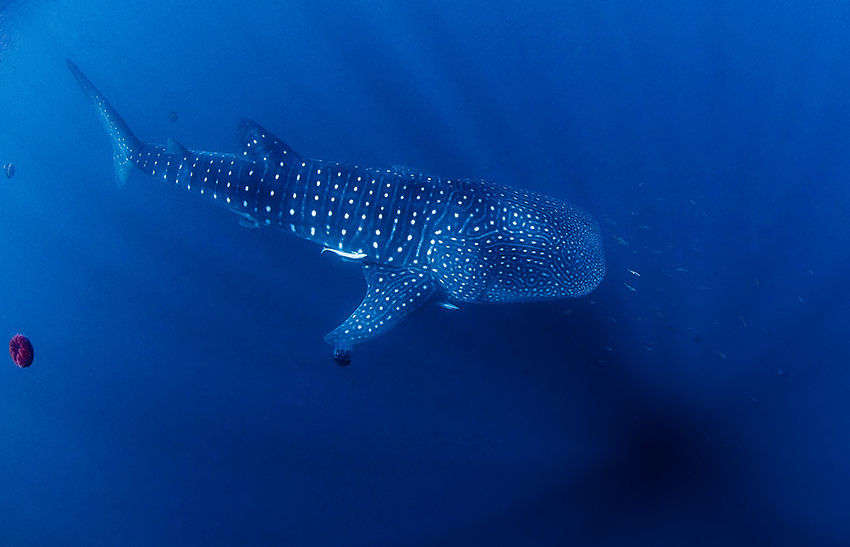

// add cover image to img directory and update filename below
ifdef::backend-html5[]

endif::backend-html5[]

== Colophon

=== Suggested citation

GBIF Secretariat & IAIA (2020) Best Practices for Publishing Biodiversity Data from Environmental Impact Assessments. Copenhagen: GBIF Secretariat. https://doi.org/10.35035/doc-5xdm-8762

=== Contributors

https://orcid.org/0000-0002-5468-2452[Andrew Rodrigues] of the GBIF Secretariat, http://orcid.org/0000-0002-2352-5497[Dag Endresen] of GBIF Norway, https://orcid.org/0000-0002-8351-4028[Rui Figueira] of GBIF Portugal, https://orcid.org/0000-0001-9244-399X[Cristina Villaverde] and https://orcid.org/0000-0003-1885-7195[Miguel Vega] of GBIF Spain, and Nick King, Asha Rajvanshi and https://orcid.org/0000-0002-7113-2196[Jo Treweek] of IAIA contributed to this version of the document.

=== Licence

The document _Best Practices for Publishing Biodiversity Data from Environmental Impact Assessments_ is licensed under https://creativecommons.org/licenses/by-sa/4.0[Creative Commons Attribution-ShareAlike 4.0 Unported License].

=== Persistent URI

https://doi.org/10.35035/doc-5xdm-8762

=== Abstract

This guide aims to help practitioners, consultants and other Interested & Affected Parties (I&APs) working with environmental impact assessments to improve the curation, archiving and management of primary biodiversity data captured during EIA processes and to share data freely and openly in standardized, accessible and interoperable formats through the Global Biodiversity Information Facility (GBIF). I&APs are encouraged to share the most detailed data possible, to support knowledge about species distributions and provide baseline data for future assessment. 

=== Document control
v1.0, December 2020

Based on an earlier publication: Cadman M, Chavan V, King N, Willoughby S, Rajvanshi A, Mathur V, Roberts R & Hirsch T (2011) Publishing EIA-Related Primary Biodiversity Data: GBIF-IAIA Best Practice Guide. Fargo, N.D., USA: IAIA Special Publication Series No. 7. Accessible at https://www.iaia.org/uploads/pdf/sp7.pdf.

=== About GBIF

GBIF—the Global Biodiversity Information Facility—is an international network and data infrastructure funded by the world’s governments and aimed at providing anyone, anywhere, open access to data about all types of life on Earth. Coordinated through its Secretariat in Copenhagen, the GBIF network of participating countries and organizations, working through participant nodes, provides data-holding institutions around the world with common standards and open-source tools that enable them to share information about where and when species have been recorded. For more information, visit https://www.gbif.org.

=== About IAIA

IAIA—the International Association for Impact Assessment—is the leading global network on best practice in the use of impact assessment for informed decision making regarding policies, programs, plans and projects. IAIA is committed to the promotion of sustainability, the freedom of access to information, and the right of citizens to have a voice in decisions that affect them. IAIA promotes the free flow of complete, unbiased and accurate information to decision-makers and affected parties. This includes biodiversity information. IAIA’s Best Practice Principles on Biodiversity-Inclusive Impact Assessment promote transparent approaches and the sharing of biodiversity data. IAIA actively encourages its members to encourage their clients to share data using the GBIF facility. For more information, visit https://www.iaia.org.

=== Cover image

Whale shark (_Rhincodon typus_), Australia. Photo 2009 Erik Schlogl via https://www.gbif.org/occurrence/1453193080[iNaturalist research-grade observations], licensed under http://creativecommons.org/licenses/by-nc/4.0/[CC BY-NC 4.0].
