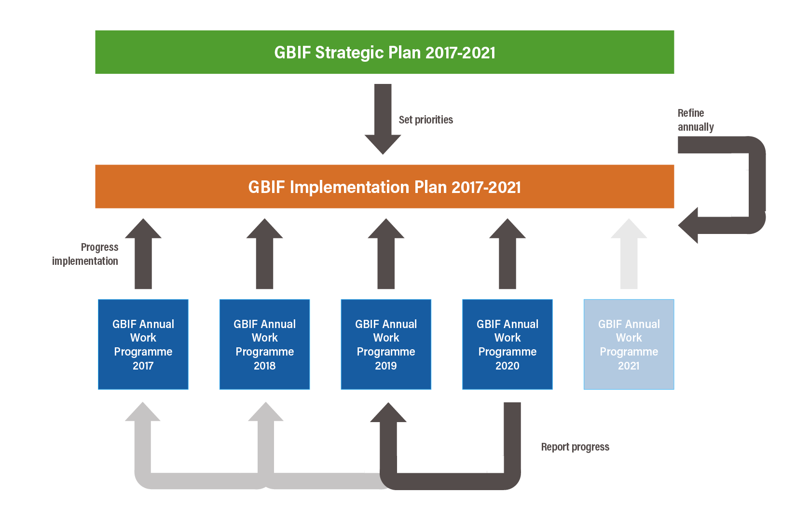

NOTE: 2020 work programme approved by the GBIF Governing Board in Leiden, 21 October 2019

== Overview

This document serves both as the 2020 revision of the <<_gbif_implementation_plan_2017_2021>> and also as the GBIF Annual Work Programme 2020. Both elements are based upon the https://www.gbif.org/strategic-plan[GBIF Strategic Plan 2017–2021].

The relationship between these documents is represented by the following graphic.

The https://www.gbif.org/strategic-plan[Strategic Plan] (agreed in 2015 at GB22) established five priorities for GBIF’s work.

The Implementation Plan presented here in this document identifies 22 activities which GBIF must undertake to address these priorities during the five-year period (and a set of specific tasks under each activity).

Each year, GBIF reviews progress against these activities and available resources (including Secretariat staff and other uses of core and supplementary funding, as well as resources committed by GBIF Participants). Using this information, an Annual Work Programme is defined for the following year. Each Annual Work Programme identifies a prioritized set of tasks for work during the year. Annual Work Programmes in the second and subsequent years also report on progress against the plan.

The Implementation Plan is reviewed and refined each year.

The Implementation Plan is presented here with updates reflecting progress during 2019 and planned activities for 2020 (the 2020 Annual Work Programme).

The Annual Work Programme 2020 is summarized below, with the revised <<_gbif_implementation_plan_2017_2021>> to follow.
